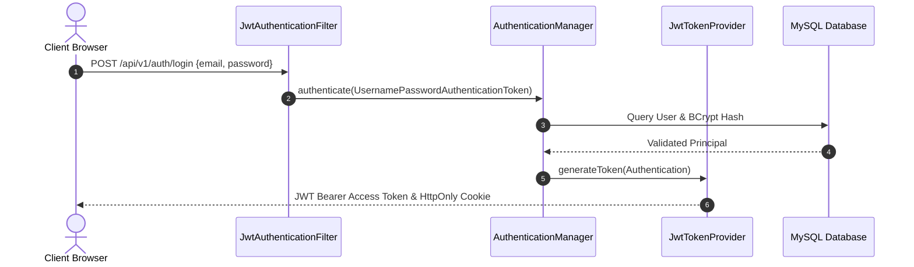

# SmartProcure - Security & Authorization Architecture

## Security Layer Blueprint

SmartProcure implements a defense-in-depth security model using Spring Security 6, JJWT (Java JWT Library), BCrypt Password Hashing, and Method-Level `@PreAuthorize` Permission Evaluation.

## Role-Based Access Control (RBAC) Matrix

| Role | Vendor Mgmt | Product Catalog | Stock Control | PR & PO Approval | Financial Matching & Payment |
| :--- | :---: | :---: | :---: | :---: | :---: |
| **ADMINISTRATOR** | Full | Full | Full | Full | Full |
| **PROCUREMENT_MANAGER** | Approve/Reject | Modify | Read | Full Approval | Read |
| **WAREHOUSE_MANAGER** | Read | Read | Adjust / Transfer | Read | Read |
| **FINANCE_MANAGER** | Read | Read | Read | Read | Full Payment |
| **VENDOR** | Self-Manage | Self Catalog | N/A | View Assigned POs | Submit Invoices |
