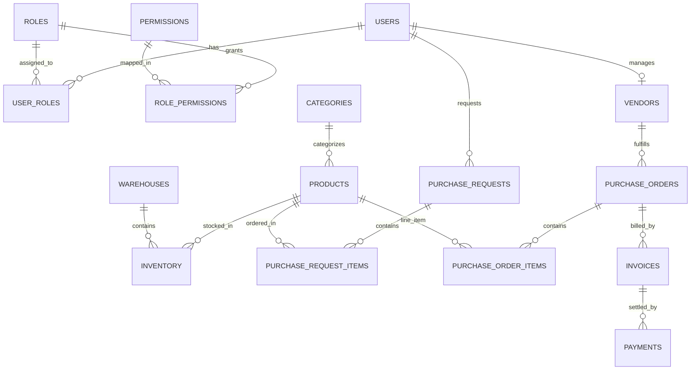

# SmartProcure - Entity Relationship Diagram

```mermaid
erDiagram
    USERS ||--o{ USER_ROLES : has
    ROLES ||--o{ USER_ROLES : assigned_to
    ROLES ||--o{ ROLE_PERMISSIONS : grants
    PERMISSIONS ||--o{ ROLE_PERMISSIONS : mapped_in

    USERS ||--o| VENDORS : manages
    CATEGORIES ||--o{ PRODUCTS : categorizes
    PRODUCTS ||--o{ INVENTORY : stocked_in
    WAREHOUSES ||--o{ INVENTORY : contains

    USERS ||--o{ PURCHASE_REQUESTS : requests
    PURCHASE_REQUESTS ||--o{ PURCHASE_REQUEST_ITEMS : contains
    PRODUCTS ||--o{ PURCHASE_REQUEST_ITEMS : ordered_in

    VENDORS ||--o{ PURCHASE_ORDERS : fulfills
    PURCHASE_ORDERS ||--o{ PURCHASE_ORDER_ITEMS : contains
    PRODUCTS ||--o{ PURCHASE_ORDER_ITEMS : line_item

    PURCHASE_ORDERS ||--o{ INVOICES : billed_by
    INVOICES ||--o{ PAYMENTS : settled_by
```
