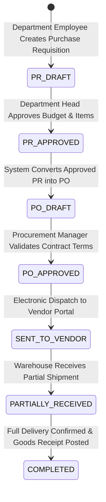

# SmartProcure - Purchase Request & Purchase Order Lifecycle Workflow

```mermaid
stateDiagram-v2
    [*] --> PR_DRAFT : Department Employee Creates Purchase Requisition
    PR_DRAFT --> PR_APPROVED : Department Head Approves Budget & Items
    PR_APPROVED --> PO_DRAFT : System Converts Approved PR into PO
    PO_DRAFT --> PO_APPROVED : Procurement Manager Validates Contract Terms
    PO_APPROVED --> SENT_TO_VENDOR : Electronic Dispatch to Vendor Portal
    SENT_TO_VENDOR --> PARTIALLY_RECEIVED : Warehouse Receives Partial Shipment
    PARTIALLY_RECEIVED --> COMPLETED : Full Delivery Confirmed & Goods Receipt Posted
```
