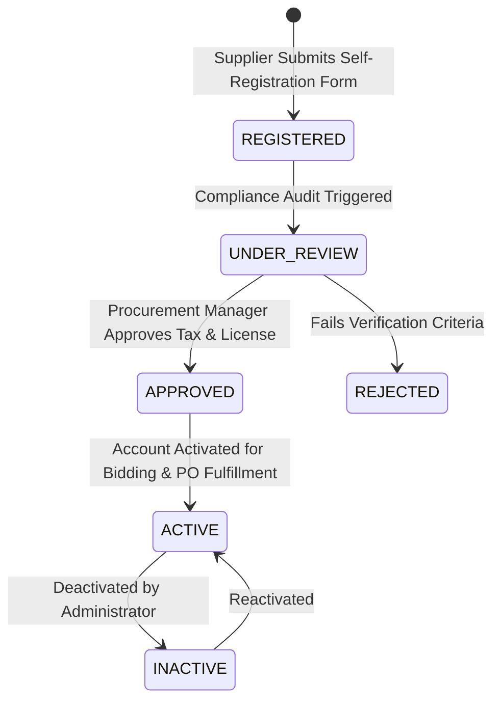

# SmartProcure - Vendor Approval & Onboarding Workflow

```mermaid
stateDiagram-v2
    [*] --> REGISTERED : Supplier Submits Self-Registration Form
    REGISTERED --> UNDER_REVIEW : Compliance Audit Triggered
    UNDER_REVIEW --> APPROVED : Procurement Manager Approves Tax & License
    UNDER_REVIEW --> REJECTED : Fails Verification Criteria
    APPROVED --> ACTIVE : Account Activated for Bidding & PO Fulfillment
    ACTIVE --> INACTIVE : Deactivated by Administrator
    INACTIVE --> ACTIVE : Reactivated
```
